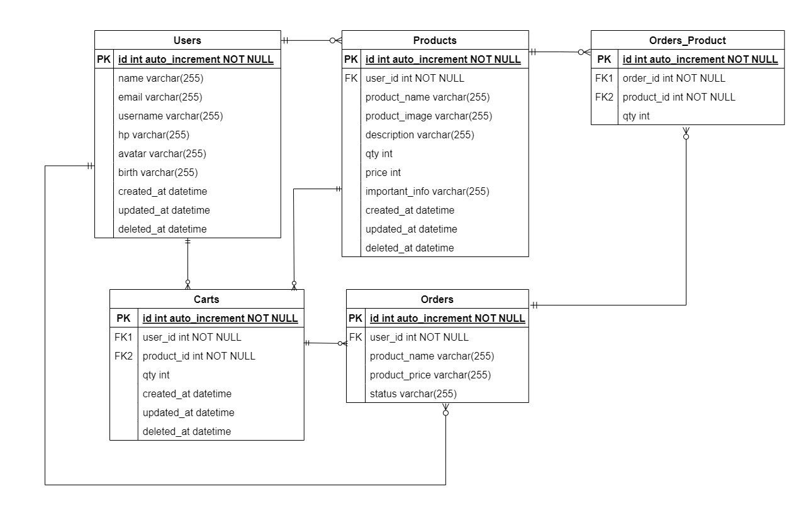

# 📑 Description

It's the backend system for our [e-commerce app project](https://github.com/Group-5-E-Commerce-App/FE-Ecommerce-App) (FE Repository)

This RESTful API was developed by using Golang and written based on Clean Architecture principles. Built with Echo as web framework, GORM as ORM, MySQL as DBMS, etc.

# About the Project

1. User can register and login
2. User can update its profile (avatar, name, username, email, date of birth, and phone number)
3. User can deactivate its own account
4. User can CRUD Products
5. User can CRUD Carts
6. and many more

# ⚡Features
- CRUD (Users, Products, Cart)
- Hashing password
- Authentication & Authorization
- Database Migration
- Automated deployment with GitHub Actions, DockerHub & AWS EC2

# ERD

# 🔥 Open API

Simply [click here](https://app.swaggerhub.com/apis-docs/ALIFMUHAMADHAFIDZ23/Group5-ECommerce/1.0.0) to see the details of endpoints we have agreed with our FE team.

  
👶 Users

  
| Method      | Endpoint            | Params      | JWT Token   | Function                                |
| ----------- | ------------------- | ----------- | ----------- | --------------------------------------- |
| POST        | /register           | -           | NO          | Register a new user                     |
| POST        | /login              | -           | NO          | Login to the system                     |
| GET         | /users/profile      | profile     | NO          | Show profile                            |
| PUT         | /users              | -           | YES         | Get data user (for edit profile form)   |
| DELETE      | /users              | -           | YES         | Deactivate user account                 |
  

  
🔖 Product

  
| Method      | Endpoint                | Params      | JWT Token   | Function                                |
| ----------- | ----------------------- | ----------- | ----------- | --------------------------------------- |
| GET         | /products               | -           | NO          | Get all products                        |
| GET         | /products/{id_product}  | id_product  | NO          | Get a product detail by its ID          |
| POST        | /products               | -           | YES         | Post a new product                      |
| PUT         | /products/{id_product}  | id_product  | YES         | Update a Product                        |
| DELETE      | /products/{id_product}  | id_product  | YES         | Delete a Product                        |
  

  
🗨️ Cart

  
| Method      | Endpoint                | Params      | JWT Token   | Function                                |
| ----------- | ----------------------- | ----------- | ----------- | --------------------------------------- |
| POST        | /carts                  |             | YES         | Add Product to Cart                     |
| GET         | /carts                  |             | YES         | Get All Product in Cart                 |
| PUT         | /carts/{id_cart}        | id_cart     | YES         | Update Product to Cart                  |
| DELETE      | /carts/{id_cart}        | id_cart     | YES         | Delete Cart                             |
  

